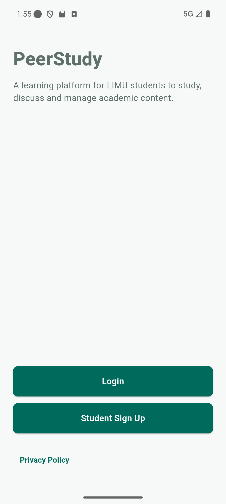

<div class="cover-page">
  
  <h1>PeerStudy</h1>
  <h2>Easy Project Guide for Student Developers</h2>
  <p class="cover-subtitle">What this project does, how it works, and the purpose of every important folder and file</p>
  <p class="cover-note">Written from the actual PeerStudy repository - not a general Flutter tutorial</p>
</div>

<div class="page-break"></div>

# Read this first

PeerStudy is a real LIMU learning application. It gives a Student one place to:

- find a Subject through the university academic structure;
- open an approved PDF supplied by an Admin;
- generate and complete a ten-question quiz from that PDF;
- discuss the Subject with other Students;
- attach private files to posts or comments;
- report unsafe Community content privately; and
- see recent posts and quiz attempts in the Profile page.

It also gives an Admin a separate dashboard to manage the academic catalog,
official PDF materials, and reported content, including restricting the author
when resolving a serious report.

This document explains **this repository as it exists now**. It covers every
maintained Dart file under `lib/`, every test, the Supabase backend files,
`pubspec.yaml`, platform folders, and the files that should not be edited.
Repeated generated files such as icon sizes and plugin registrants are grouped
together because Flutter recreates them automatically.

> The shortest mental model: screens show PeerStudy, providers/controllers hold
> temporary screen state, services communicate with Supabase, models describe
> the returned data, and Supabase enforces the important rules.

## Quick contents

1. What PeerStudy is built for
2. What a Student actually does
3. What an Admin actually does
4. How the app and Supabase fit together
5. Every top-level folder
6. Every Dart file under `lib/`
7. The real `pubspec.yaml`
8. The actual Supabase backend
9. Four important feature flows
10. Every test file
11. Platform folders
12. Root files and supporting folders
13. Where to make common changes
14. Why another laptop may fail to sign in
15. Safe commands
16. Files not to edit or commit
17. A simple reading path through the code

# 1. What PeerStudy is built for

## The problem it solves

Course material, quizzes, and class discussions can become separated across
different systems. PeerStudy groups all three around one selected Subject.

The app is deliberately not a public social network and not a complete
university management system. It is a focused, subject-based learning and
collaboration application for LIMU's School of Technology and Engineering.

It currently has no private messaging, official grading, general feedback
submission form, permanent Student PDF library, or standalone Admin user list.

## The two application roles

| Role | How the account is created | What the role can do |
| --- | --- | --- |
| Student | Public signup with a complete `@limu.edu.ly` email | Browse Subjects, read approved PDFs, take quizzes, use Communities, report content, and manage their Profile |
| Admin | Pre-created by a trusted project operator | Manage the catalog and PDFs, review reports, remove content, and restrict an author while resolving a report |

There is no public Admin signup. A phone request cannot turn a new account into
an Admin because the database creates public accounts with the Student role.

## The academic structure used by the app

```text
School of Technology and Engineering
|
+-- Information Technology
|   +-- Software Engineering
|   +-- Network
|   +-- Telecommunications
|   +-- Health Informatics
|   +-- Artificial Intelligence (AI)
|
+-- Engineering
    +-- Architectural and Structural Engineering
    +-- Mechatronics
    +-- Interior Design
```

The seed data includes one reference Subject named **Software Engineering
Fundamentals**. More Subjects are created by an Admin; they are not hard-coded
as extra Flutter screens.

Every Subject owns exactly one Community. The Community is where that Subject's
posts, comments, and attachments live.

# 2. What a Student actually does in the app



## Step 1: create or enter an account

The first public screen offers Login and Student Sign Up.

- Signup asks for full name, LIMU email, password, and password confirmation.
- The app accepts a complete LIMU address, not only the part before `@`.
- A new password must contain 8-128 characters, at least one letter, and at
  least one digit. Login still accepts six characters for the existing legacy
  classroom Admin credential.
- Supabase Auth creates the identity.
- A database trigger creates the matching active `profiles` row as a Student.

An existing Admin can type the exact Admin alias supported by the validator;
the app converts it to the configured Admin email before asking Supabase Auth to
sign in. The Admin identity and Admin profile must already exist on the server.

`LoginPreferenceService` stores only a Boolean and user UUID, but the
`supabase_flutter` SDK separately persists the real Auth session it needs to
restore login. The harmless marker never replaces or grants that session.

## Step 2: enter the Student application

The Student shell has three bottom-navigation destinations:

1. **Home** - explains the learning flow and can reopen the real Subject chosen
   during the current app process.
2. **Catalog** - starts the School -> Area -> Department -> Subject journey.
3. **Profile** - shows account information, saved study path, recent posts,
   recent quizzes, settings, support pages, and sign out.

The shell uses an `IndexedStack`, so switching tabs does not recreate every tab
from zero.

## Step 3: choose a Subject

The catalog reads active rows from Supabase in this order:

```text
School
  -> Academic Area
      -> Department
          -> Subject
```

While the app process is open, the complete selected Area, Department, and
Subject objects are held in memory. Only their IDs are persisted. After an app
restart, Profile can say that a recent path exists, but Home cannot reconstruct
and reopen the full Subject object until the Student visits Catalog and selects
it again. This memory never creates or changes official academic data.

## Step 4: use the Subject workspace

One Subject opens a workspace with three tabs:

| Tab | What happens |
| --- | --- |
| Materials | Lists only approved PDFs for the selected Subject and opens one using a temporary signed URL |
| AI Quiz | Lets the Student select one approved PDF, generate exactly ten questions, answer them, submit once, and review corrections |
| Community | Shows live posts/comments for the Subject, including ready private attachments and reporting actions |

If a quiz is unfinished, the workspace asks before allowing the Student to
leave it accidentally.

Community initially loads the 25 newest posts and can request older pages. A
report reason is one of spam, harassment, misinformation, inappropriate
content, copyright, or other. A post or comment can have up to three private
attachments, each no larger than 10 MiB, in JPG/JPEG, PNG, WebP, PDF, or UTF-8
TXT format.

Opening the AI Quiz tab does not call the AI automatically. The Student must
choose one approved PDF and press **Start Quiz**.

## Step 5: use Profile

Profile combines several sources:

- the trusted Supabase `profiles` row for name, role, and account status;
- local settings for theme and last selected study path;
- the Student's latest active Community posts; and
- the Student's latest submitted quiz attempts.

One Recent Activity refresh button starts the Posts and Quiz queries together.
While that refresh is running, another quick tap is ignored. Each result card
can still succeed or fail independently, so a Posts failure does not hide a
valid Quiz result. Failures become readable messages instead of Flutter's red
crash screen.

# 3. What an Admin actually does

The Admin receives a separate dashboard with two tabs.

## Academic tab

The Academic tab manages the real hierarchy stored in PostgreSQL:

1. Academic Area (fixed Engineering/IT dropdown)
2. Departments
3. Subjects
4. Official PDF Materials

Creating a Subject also creates its one Community in the same database
transaction. Official PDFs begin in an `uploading` state, are uploaded to a
private Storage bucket, receive a checksum, and become `approved` only when the
upload has completed.

Academic Areas are fixed to Engineering and IT and have no Admin create, edit,
or delete controls. An Admin can add/edit Department and Subject rows, upload or replace a PDF, edit material
details, and remove a material. Removing a material closes Student access first;
private byte cleanup happens afterward. One official PDF may be at most 25 MiB.
Catalog forms can mark rows active/inactive, and deletion fails safely when
dependent database content still exists.

## Reports tab

A Student report targets exactly one post or one comment. The Admin sees the
reason, optional details submitted with the report, target preview, time, and
any ready attachments. The card does not reveal the reporter's identity. For a
pending report, the Admin can:

- **Dismiss** - leave the content active and close the report;
- **Remove content** - hide the reported post/comment and close the report; or
- **Restrict author** - restrict the Student author and close the report. The
  reported content remains unless **Remove content** is chosen separately.

The Reports tab loads at most 200 reports newest-first and lets the Admin switch
between Pending and Resolved views.

Every action needs a resolution note and is written to the Admin audit log.
The newest migration makes removal idempotent: if the target is already gone,
the report can still be resolved without crashing the Flutter screen.

The current dashboard has no separate Student-management tab. Its visible
restriction action belongs to report resolution. The backend also contains an
audited `admin_set_user_status` function, but it is not exposed as a standalone
account list in the current UI.

Important: adding a migration file to Git does not update the hosted database.
The project owner must apply the migration to the correct Supabase project.

# 4. How the whole project fits together

```text
                         PEERSTUDY PHONE / WEB APP

User tap
   |
   v
lib/screens/         The pages the Student or Admin sees
   |
   +--> lib/components/   Reusable buttons, forms, loading/error views
   |
   +--> lib/providers/    Catalog, Community, quiz, and settings state
   |
   +--> lib/services/     Auth, database, Storage, RPC, Edge Function calls
   |
   +--> lib/models/       Safe Dart objects created from backend data
   |
   v
                              SUPABASE

Auth            PostgreSQL          Storage          Realtime       Edge Functions
accounts        app data/RLS        private files    Community      quiz + file checks
```

There is no single compulsory path for every Supabase call. `AuthService`,
`SubjectRepository`, Profile's `StudentActivityReader`, and parts of the Admin
dashboard use the Supabase SDK directly. `BackendApiService` centralizes the
larger protected operations such as files, quizzes, reports, and compatibility
helpers.

## Why rules exist in Flutter and Supabase

Flutter validation gives fast, friendly feedback. It is not the final security
boundary because a modified client could skip Flutter checks. Supabase repeats
identity, role, status, ownership, and relationship checks using Row Level
Security, database functions, and Edge Functions.

Examples:

- Flutter hides the Admin dashboard from Students; Supabase also rejects Admin
  operations from a Student token.
- Flutter checks the official PDF name and size; Storage/database rules also
  enforce Admin-only access, declared PDF MIME type, and the size limit.
- Flutter never receives a quiz answer key before submission; scoring happens
  in the server function.

## Small words used throughout this guide

| Word | Easy meaning in PeerStudy |
| --- | --- |
| SDK | A package that gives Dart code ready-made Supabase operations |
| JSON | The key/value data shape exchanged between Flutter and server code |
| UUID | A long unique ID used for users, Subjects, files, and retry requests |
| RPC | A protected PostgreSQL function that Flutter calls through Supabase |
| RLS | Row Level Security: database rules deciding which rows this session may read or change |
| PostgREST | Supabase's HTTP interface that turns table queries into database operations |
| Edge Function | TypeScript code running on Supabase's server, not inside the phone |
| Storage bucket | Private file area holding official PDFs or Community attachments |
| Idempotency key | A request UUID that lets a retry return the first result instead of creating a duplicate |
| Checksum | A SHA-256 fingerprint used to detect changed or incorrect file bytes |
| Realtime | A subscription that tells Community screens when database rows change |

<div class="page-break"></div>

# 5. Repository map: every top-level folder

| Folder | What it contains in this project | Normally edit it? |
| --- | --- | --- |
| `lib/` | All production Dart code for the PeerStudy app | Yes - most Flutter work starts here |
| `test/` | Offline unit and widget regression tests | Yes - add/update tests with behavior changes |
| `supabase/` | Database schema changes, seed data, server functions, and backend scripts | Yes, when backend behavior changes |
| `assets/` | The master PeerStudy launcher artwork | Only when changing the official icon |
| `docs/` | Product, architecture, setup, backend, audit, and evidence documents | Yes, when documentation changes |
| `android/` | Android wrapper, app ID, Internet permission, deep link, Gradle build, signing template, and generated icons | Only for Android/build configuration |
| `ios/` | iPhone/iPad Xcode wrapper, app metadata, recovery deep link, and generated icons | Only for iOS configuration |
| `web/` | Browser entry HTML, PWA manifest, favicon, and web icons | Only for web configuration |
| `windows/` | Windows C++ runner and CMake build wrapper | Rarely; normal app features stay in `lib/` |
| `linux/` | Linux runner and CMake build wrapper | Rarely; normal app features stay in `lib/` |
| `macos/` | macOS Xcode/Swift runner, entitlements, and generated icons | Only for macOS configuration |
| `.github/` | GitHub Actions workflow that checks and builds the project | When changing CI |
| `.vscode/` | Shared VS Code setting; currently automatic Java build configuration | Rarely |
| `.idea/` | Android Studio/IntelliJ workspace files | No - mostly local/ignored data |
| `.git/` | Git history, branches, and internal repository data | Never edit manually |
| `.dart_tool/` | Generated Dart/Flutter dependency and tool state | Never edit manually |
| `build/` | Generated builds, test output, APK intermediates, and caches | Never edit; Flutter recreates it |

The six platform folders do not contain six independent PeerStudy apps. They
are launch/build wrappers around the same Dart application in `lib/`.

# 6. The `lib/` folder, explained using PeerStudy

`lib` means **library**. In this repository, it contains the 53 Dart source
files that are compiled into PeerStudy.

`lib/main.dart` is the front door. A project import such as:

```dart
import 'package:peerstudy/services/auth_service.dart';
```

means "open `lib/services/auth_service.dart` from the package named
`peerstudy`." The name `peerstudy` comes from `pubspec.yaml`.

## `lib/main.dart`

Purpose: start the whole application safely.

It prepares Flutter plugins, initializes Supabase, loads saved settings, starts
the Auth recovery listener, verifies a saved session/profile, selects Login or
the correct role home, and builds `MaterialApp` with PeerStudy themes/routes.
If backend configuration is invalid, it shows a controlled setup screen instead
of exposing URLs, keys, or an SDK exception.

## `lib/components/` - reusable visual pieces

These files prevent the same basic UI from being rewritten on many screens.

| File | Easy purpose in PeerStudy |
| --- | --- |
| `app_button.dart` | Standard large action button used by forms; can disable itself and show progress while a request runs |
| `app_form_field.dart` | Consistent text/password input, validation display, and password show/hide button |
| `auth_page_shell.dart` | Shared responsive layout/header for Login, Signup, Forgot Password, and Reset Password pages |
| `editorial_info_page.dart` | Shared numbered-article layout used by Privacy, Terms, and Community Guidelines |
| `empty_state_view.dart` | Reusable generic no-data view; current feature screens mostly use their own specific empty states, so this component is presently available but unused |
| `error_view.dart` | Friendly error panel with an optional Retry action |
| `loading_view.dart` | Standard centered progress state while data is loading |
| `role_guard.dart` | Rechecks the real session/profile before a protected route appears; safely handles a wrong role or a restricted/missing profile |

## `lib/config/` - public connection configuration

| File | Easy purpose in PeerStudy |
| --- | --- |
| `supabase_config.dart` | Holds the hosted Supabase URL, public publishable key, and `io.supabase.peerstudy://login-callback`; supports build-time replacement with `--dart-define` and rejects secret/service-role key shapes |

The values here are public client configuration. A service-role key, database
password, AI key, or signing password must never be put in Flutter code.
The checked-in default currently targets hosted project reference
`xihsvhhkbaaypmjjtzxa`; another project must be supplied with matching
`--dart-define` values.

## `lib/models/` - shapes of PeerStudy data

A model turns a loose JSON/database row into a predictable Dart object.

| File | Easy purpose in PeerStudy |
| --- | --- |
| `app_user.dart` | Describes the signed-in profile: UUID, full name, LIMU email, Student/Admin role, active/restricted status, and timestamps; malformed security values fail closed |
| `subject.dart` | Describes School, the two supported Areas, Department, Subject, and approved Material; checks that parent IDs and statuses make sense |
| `quiz.dart` | Describes and validates public quiz questions, in-progress answers, submitted results, and corrections; its pre-submit question model has no answer-key property |
| `community_attachment.dart` | Describes attachment metadata and selected local bytes; owns allowed types, three-file limit, 10 MiB limit, validation, and readable size text |

## `lib/providers/` - feature state and repositories

The folder name can be confusing: PeerStudy does **not** use the external
Provider package. These are ordinary Dart controllers/repositories used by
`StatefulWidget` screens.

| File | Easy purpose in PeerStudy |
| --- | --- |
| `subject_provider.dart` | Reads the School/Area/Department/Subject/Material catalog from Supabase and keeps the current Area, Department, and Subject in memory |
| `academic_provider.dart` | Despite its name, this is mainly the Community layer: post/comment models, paginated reads, realtime subscriptions, create/edit/remove calls, and refresh/error state; it also has an unused post-report helper while the current report sheet calls `BackendApiService` directly |
| `quiz_provider.dart` | Runs the quiz state machine: choose Material, generate, select answers, move between ten questions, submit, retry, show results, or abandon |
| `settings_provider.dart` | Holds local theme and last academic path; saves atomically, restores old formats, rolls back failed saves, and clears account-specific choices on sign out |

## `lib/routes/` - page names and access routing

| File | Easy purpose in PeerStudy |
| --- | --- |
| `app_routes.dart` | One list of route strings such as `/login`, `/student-shell`, `/settings`, and `/admin-dashboard` so screens do not repeat magic strings |
| `app_router.dart` | Converts each route string into the correct screen, adds `RoleGuard` to protected pages, and shows a useful Page Not Found screen for an invalid route |

Only top-level destinations use this named-route table. Nested pages such as
Departments, Subjects, Subject Workspace, secure PDF opener, Account, and Admin forms
are opened directly with `MaterialPageRoute`.

## `lib/screens/auth/` - account screens

| File | Easy purpose in PeerStudy |
| --- | --- |
| `login_screen.dart` | Collects LIMU email or Admin alias plus password, calls `AuthService`, and sends the verified role to Student shell or Admin dashboard |
| `signup_screen.dart` | Creates Student accounts only; collects full name, university email, password, and confirmation and handles email-confirmation state |
| `forgot_password_screen.dart` | Sends a Supabase password-recovery email to a validated LIMU address |
| `reset_password_screen.dart` | Receives a valid recovery session from the app deep link and lets the user set a new password |

The screens own form fields and loading messages. `auth_service.dart` owns the
actual Auth/session work.

## `lib/screens/student/` - the learning experience

| File | Easy purpose in PeerStudy |
| --- | --- |
| `student_shell_screen.dart` | Main Student frame with Home, Catalog, and Profile bottom tabs preserved in an `IndexedStack` |
| `student_home_screen.dart` | Shows school context, explains Materials/Quiz/Community, and opens the genuine Subject object selected during the current app process when available |
| `student_departments_screen.dart` | First loads the active Academic Areas, then lists valid Departments for the Area the Student taps |
| `student_subjects_screen.dart` | Lists active Subjects belonging to one Department and saves the chosen study path |
| `student_subject_workspace_screen.dart` | Hosts the selected Subject's Materials, AI Quiz, and Community tabs and protects an unfinished quiz from accidental exit |
| `material_viewer_screen.dart` | Requests a temporary signed URL for one approved PDF and opens it in the device's browser or installed PDF app, with loading, retry, and duplicate-tap protection |
| `subject_quiz_view.dart` | Shows Material selection, generation/loading/error states, ten-question answering, Submit, score, and correction cards |
| `subject_community_views.dart` | Complete Community UI: realtime feed, posts, comments, edit/remove, attachment pick/upload/open/download, and private report sheet |

## `lib/screens/admin/` - management and moderation

| File | Easy purpose in PeerStudy |
| --- | --- |
| `admin_dashboard_screen.dart` | Loads and manages catalog rows, official PDF metadata/uploads, pending/resolved reports, target previews, attachments, and report actions |
| `admin_form_pages.dart` | Validated full-page forms and result objects for Department, Subject, and Material add/edit work; Areas are fixed dropdown choices |
| `admin_resolution_note_dialog.dart` | Small lifecycle-safe dialog that requires the Admin's audit note before dismiss/remove/restrict is submitted |

## `lib/screens/profile/` - account and information pages

| File | Easy purpose in PeerStudy |
| --- | --- |
| `student_profile_screen.dart` | Shows trusted profile data, edits full name, displays saved study path and recent posts/quizzes, uses one guarded refresh for both queries with per-section results, links to other pages, and signs out |
| `student_account_screen.dart` | Displays email, role, account status, and the password-reset action from verified account data |
| `settings_screen.dart` | Lets the user select and save PeerStudy's light or dark theme locally |
| `community_guidelines_screen.dart` | Static rules explaining acceptable behavior in Subject Communities |
| `feedback_screen.dart` | Explains that content must be reported inside its Community and links general questions to Support; it neither submits feedback nor directly opens a report form |
| `support_screen.dart` | Displays support choices and opens email only when `SUPPORT_EMAIL` was supplied at build time |
| `privacy_policy_screen.dart` | Plain-language explanation of account, academic, quiz, Community, attachment, and device data use |
| `terms_screen.dart` | Usage terms for accounts, approved materials, quizzes, Community behavior, and access restrictions |
| `about_screen.dart` | Short description of PeerStudy's purpose and two-role design |

## `lib/services/` - boundaries to Auth, Supabase, files, and local storage

| File | Easy purpose in PeerStudy |
| --- | --- |
| `supabase_service.dart` | Initializes one shared Supabase client from public config and records whether startup succeeded |
| `auth_service.dart` | Owns signup, sign in, profile verification, session restoration, recovery events, password update, sign out, cached-profile replacement, and friendly Auth errors; Profile calls the full-name RPC directly |
| `backend_api_service.dart` | Main safe gateway for Material upload/access, Community attachments, quiz functions, report functions, Admin actions, checksums, RPC parsing, and friendly backend failures; it also retains currently unused compatibility helpers for registration/session/recent quizzes/account status |
| `login_preference_service.dart` | Saves only a harmless login marker and matching user UUID; it never saves the password or Auth token |
| `settings_storage.dart` | Conditional export that chooses browser or non-browser settings implementation at compile time |
| `settings_storage_io.dart` | Uses SQLite on Android/iOS and SharedPreferences fallback on desktop; migrates older preference keys |
| `settings_storage_web.dart` | Uses browser-compatible SharedPreferences storage for theme and recent study path |

## `lib/theme/` and `lib/utils/`

| File | Easy purpose in PeerStudy |
| --- | --- |
| `theme/app_theme.dart` | One blue/white and dark Material 3 visual system for colors, typography, spacing, form borders, buttons, cards, and phone status/navigation bars |
| `utils/validators.dart` | Shared LIMU email normalization, exact Admin alias mapping, password rules, and non-empty form checks |

<div class="page-break"></div>

# 7. `pubspec.yaml`, explained for this exact project

`pubspec.yaml` is PeerStudy's Flutter manifest. Flutter reads it before it can
resolve imports, download packages, run tests, generate icons, or build the app.

## Project identity values

| Current value | What it changes in PeerStudy |
| --- | --- |
| `name: peerstudy` | Makes imports begin with `package:peerstudy/...` |
| Project description | Identifies PeerStudy as a secure subject-based LIMU learning/collaboration app |
| `publish_to: none` | Prevents accidental upload of this application to pub.dev |
| `version: 1.0.0+1` | App version is `1.0.0`; Android/iOS build number is `1` |
| `sdk: ^3.12.0` | Requires Dart 3.12 or later within major version 3 |

YAML indentation is part of the file's meaning. Use spaces, not tabs. After
editing dependencies, run `flutter pub get`.

## Runtime packages and why PeerStudy uses each one

| Package | Exact use in this repository |
| --- | --- |
| `flutter` | Material widgets, navigation, forms, themes, async UI, and all screens |
| `cupertino_icons` | Declared for iOS-style glyphs, but no current `lib/` or `test/` file imports it |
| `supabase_flutter` | Auth sessions, PostgREST database reads, RPCs, private Storage, Realtime, and Edge Function calls |
| `uuid` | Unique idempotency/request keys so retries do not create duplicate posts, uploads, quizzes, or attempts |
| `file_picker` | Lets Admins select official PDFs and Students select Community attachments |
| `url_launcher` | Opens support mail links, official lecture PDFs, and temporary Community attachment links with an external app |
| `shared_preferences` | Stores the safe login marker and browser/desktop preference fallback |
| `sqflite` | Stores settings in a small SQLite database on Android and iOS |
| `crypto` | Computes SHA-256 for uploaded official PDFs and for stable deterministic UUID compatibility helpers; Community attachment hashing is repeated by its server function |
| `http` | Declared/reserved dependency, but current app code has no direct import; uploads currently use `supabase_flutter` APIs |

## Development-only packages

| Package | Exact use |
| --- | --- |
| `flutter_test` | Unit and widget tests under `test/` |
| `flutter_lints` | Rules used by `flutter analyze` through `analysis_options.yaml` |
| `flutter_launcher_icons` | Generates Android, iOS, web, Windows, and macOS icons from the one master PNG |

The master icon is `assets/branding/peerstudy_app_icon.png`. It is configured as
input to the icon generator. The current `flutter:` section does not declare a
runtime `assets:` list, so adding `Image.asset(...)` later also requires adding
that image under `flutter.assets`.

## `pubspec.lock` is different

`pubspec.yaml` contains allowed dependency versions. `pubspec.lock` records the
exact resolved versions used for this application. Commit the lock file so a
teammate and GitHub Actions resolve the same packages. Do not hand-edit it.

<div class="page-break"></div>

# 8. The actual Supabase backend

Flutter is only the client. The backend stored/deployed through Supabase owns
identity, shared data, permissions, private files, realtime events, and server
work.

## Main tables and what each one stores

| Table | PeerStudy data stored there |
| --- | --- |
| `profiles` | App profile connected to an Auth UUID: full name, LIMU email, role, and active/restricted status |
| `schools` | The School of Technology and Engineering root row |
| `academic_areas` | Information Technology and Engineering areas |
| `departments` | Software Engineering, Network, Mechatronics, and the other seeded Departments |
| `subjects` | Admin-managed Subjects under a Department |
| `communities` | Exactly one Community linked to each Subject |
| `subject_materials` | Official PDF metadata, private path, checksum, version, status, and approval information |
| `community_posts` | Student posts, ownership, body, version, count, and active/removed state |
| `community_comments` | Student replies linked to a post, with ownership/version/status |
| `community_attachments` | Private attachment metadata and uploading/ready/removed lifecycle |
| `quizzes` | Generated question set including the private answer key; Students cannot directly read this private row |
| `quiz_attempts` | One Student's submitted answers, score, total, corrections, and completion time |
| `reports` | Private reports and their pending/resolved decision information |
| `admin_audit_log` | Record of privileged Admin changes and reasons |

Supabase Auth identities live in Supabase's managed Auth schema, not in a Dart
file and not in `seed.sql`.

## `supabase/migrations/`

| File | Exact purpose |
| --- | --- |
| `20260828000100_peerstudy_corrected_master.sql` | Creates core tables, constraints, triggers, Student/Admin RPCs, RLS policies, official-material Storage bucket/policies, Realtime setup, and permissions |
| `20260830000100_community_attachments.sql` | Adds attachment metadata, quotas/lifecycle RPCs, triggers, private attachment Storage bucket, and matching RLS/Storage policies |
| `20260902000100_admin_report_delete_safety.sql` | Makes dismiss/remove safe when target content is missing or already removed and makes repeated successful removal a no-op; restrict still fails closed unless the Student author exists |

Migrations are ordered changes. After one has reached a shared database, add a
new timestamped migration instead of rewriting history.

## `supabase/functions/` - trusted server code

| File/folder | Exact purpose |
| --- | --- |
| `generate-quiz/index.ts` | Authenticates an active Student, verifies the Subject/PDF/checksum, safely retries by idempotency key, asks the configured AI provider for ten valid questions, stores private answers, and returns public questions only |
| `submit-quiz/index.ts` | Loads the private quiz with server authority, validates ten answers, scores once, stores one attempt, and returns corrections after submission |
| `finalize-community-attachment/index.ts` | Downloads the uploaded private object, confirms owner/target, size, MIME type, real file signature or UTF-8 text, and SHA-256 before marking it ready |
| `cleanup-community-attachments/index.ts` | Permanently deletes only hidden, removed, or incomplete private attachment bytes after Student/Admin authorization |
| `_shared/http.ts` | Shared authentication, active-profile/Subject checks, safe JSON responses, CORS, environment-value checks, UUID parsing, and non-leaking errors |
| `_shared/quiz.ts` | Quiz types, strict ten-question/four-option validation, AI request, public-question conversion, answer validation, scoring, and hashing |
| `_shared/community_attachment.ts` | Attachment row contract, owner/target checks, size/type/signature validation, and hashing |
| `_shared/community_attachment_test.ts` | Offline Deno tests proving accepted file signatures, rejected misleading files, and expected SHA-256 output |

## Other Supabase files

| File/folder | Exact purpose |
| --- | --- |
| `config.toml` | Local CLI service ports, Auth redirect rules, Storage limits, and JWT verification settings for functions |
| `seed.sql` | Inserts only the reviewed School, Areas, Departments, reference Subject, and its Community; it creates no accounts, PDFs, posts, reports, quizzes, or attempts |
| `scripts/bootstrap-admin.ts` | Privileged operator script for creating/updating the requested test Admin without putting a service-role key in Flutter |
| `scripts/hosted-smoke.ts` | Hosted end-to-end acceptance script using temporary test data and cleanup |
| `functions/.env.example` | Safe template naming required server variables |
| `functions/.env` | Ignored local real AI/server secrets; never commit or copy this into Flutter |
| `.temp/` | Ignored machine-specific Supabase link/cache state |

The client and server both enforce file type, three files per post/comment, and
10 MiB per file. The server additionally enforces ten new reservations per
Student per minute and 100 MiB of uncleaned ready/in-progress bytes per Student.
An authorized open/download tap receives a signed link lasting 60 seconds.

# 9. Four important feature flows

## Authentication

```text
signup_screen.dart
  -> AuthService.signUp
  -> Supabase Auth user
  -> database trigger
  -> active Student profiles row
  -> role verification
  -> Student shell
```

On later launches, the local login marker is not trusted by itself. The marker,
Supabase session UUID, and current server profile must agree before automatic
entry is allowed.

## Official PDF Material

```text
Admin selects PDF
  -> backend_api_service.dart validates metadata
  -> subject_materials row = uploading
  -> signed private Storage upload
  -> SHA-256 saved
  -> row = approved
  -> Student taps Material
  -> ten-minute signed URL
  -> device browser or installed PDF app
```

The file is private. A Student receives only a temporary signed link after RLS
checks access; PeerStudy never exposes a permanent public Storage URL.

## AI Quiz

```text
Student chooses one approved PDF
  -> quiz_provider.dart creates stable request UUID
  -> generate-quiz Edge Function downloads/verifies PDF
  -> configured AI produces exactly 10 validated questions
  -> private answer key stays in quizzes table
  -> Student answers public questions
  -> submit-quiz scores on server
  -> quiz_attempts row + corrections returned
```

There are no fake fallback questions when the AI service is not configured.
The app should show a configuration/retry error instead.

## Community report and Admin removal

```text
Student opens Report sheet on one post/comment
  -> create_content_report RPC
  -> private pending reports row
  -> Admin Reports tab
  -> resolution-note dialog
  -> admin_resolve_report RPC
  -> report status + content/account action + audit log
```

The safety migration handles a target that another action already removed. The
Admin UI also accepts a missing preview and refreshes the report instead of
dereferencing null data.

<div class="page-break"></div>

# 10. The `test/` folder - every current test file

| Test file | What regression it protects |
| --- | --- |
| `academic_provider_serialization_test.dart` | Community post/comment/report parsing and safe serialized values |
| `admin_report_moderation_test.dart` | Widget behavior of the required resolution-note dialog plus checks that the safety migration contains the expected missing-target/idempotency ordering; it does not execute PostgreSQL |
| `auth_role_guard_test.dart` | LIMU validation, trusted profile roles/status, normalized names, and protected route decisions |
| `backend_function_error_test.dart` | Safe conversion of Edge Function responses into friendly `BackendException` messages |
| `community_attachment_test.dart` | Allowed types, file count/size, metadata parsing, and attachment validation |
| `login_preference_service_test.dart` | Harmless saved-login marker behavior without password/token storage |
| `quiz_model_test.dart` | Ten-question model contracts and parsing of an answer-free public fixture; the Edge Function's output filtering is the real answer-key security control |
| `quiz_provider_test.dart` | Quiz controller transitions, answering, submission, retries, and results |
| `settings_provider_test.dart` | Theme/study-path serialization, save rollback, migration, and clearing |
| `student_profile_account_test.dart` | Profile/Account UI, concurrent activity refresh, duplicate-tap protection, independent section results, error/retry behavior, and navigation |
| `subject_hierarchy_test.dart` | School/Area/Department/Subject/Material parsing and correct relationships |
| `widget_test.dart` | Cold startup to Login and role-guard behavior at app level |

Tests do not use the real hosted backend for ordinary runs. They protect local
logic and widgets. The hosted smoke script and a physical-phone walkthrough are
still needed for deployment confidence.

# 11. Platform folders without the confusion

## `android/` - primary tested build target

| Important path | Purpose |
| --- | --- |
| `app/src/main/AndroidManifest.xml` | Names PeerStudy, grants Internet access, disables backup, starts `MainActivity`, and registers the Supabase confirmation/recovery deep link |
| `app/build.gradle.kts` | Uses app ID `ly.edu.limu.peerstudy`, Java 17, Flutter versions, and optional private release signing; falls back to local debug signing for classroom APK tests |
| `app/src/main/kotlin/.../MainActivity.kt` | Tiny native Android entry point that hosts Flutter |
| `app/src/main/res/` | Launch theme, backup rules, and generated launcher icons at Android density sizes |
| `key.properties.example` | Placeholder format for a future private keystore; real `key.properties` is ignored |
| `gradle/`, `gradlew`, `gradlew.bat`, `settings.gradle.kts` | Android/Gradle wrapper and project wiring used by `flutter build apk` |

## `ios/`

`Runner/Info.plist` names PeerStudy and registers
`io.supabase.peerstudy` so confirmation/recovery links can return to the app.
`AppDelegate.swift`, `SceneDelegate.swift`, the Xcode project/workspace, launch
storyboards, and generated AppIcon catalog form the iOS wrapper.

## `web/`

`index.html` loads Flutter in a browser. `manifest.json` describes the
installable PeerStudy web app, portrait preference, colors, description, and
icons. `favicon.png` and `icons/` are generated browser artwork.

## `windows/` and `linux/`

These contain native runner code and CMake files needed to package Flutter for
desktop. Normal PeerStudy features should not be duplicated there. Files named
`generated_plugin_registrant` or `generated_plugins.cmake` are recreated from
`pubspec.yaml`.

## `macos/`

This contains the Swift/Xcode runner, app metadata, icon catalog, and sandbox
entitlements. Current repository note: its Debug/Release entitlements do not
declare the outbound `com.apple.security.network.client` capability. A sandboxed
macOS build may therefore fail to reach Supabase even when Android/web works.
That is a platform configuration issue, not evidence that the password is
wrong.

# 12. Root files and supporting folders

## Important root files

| File | Purpose |
| --- | --- |
| `README.md` | Fast project overview, setup/deployment commands, APK location, and links to deeper documents |
| `PeerStudy-Project-Guide.md` | Editable source used to generate this project-specific PDF |
| `PeerStudy-Project-Guide.pdf` | Generated, easy-to-share PDF version of this guide |
| `pubspec.yaml` | Flutter manifest and requested dependency ranges |
| `pubspec.lock` | Exact resolved dependency versions; commit it, but let Flutter edit it |
| `analysis_options.yaml` | Enables the `flutter_lints` rules used by IDEs and `flutter analyze` |
| `.gitignore` | Excludes caches, builds, logs, APKs, private signing files, Supabase link state, and secrets |
| `.metadata` | Flutter tool migration metadata; Flutter says not to edit it manually |
| `supabase.example.json` | Placeholder public connection example for another project; the Flutter app does not automatically load it |
| `.flutter-plugins-dependencies` | Generated plugin metadata based on `pubspec.yaml`; do not edit or commit it manually |
| `peerstudy.iml` | Generated/local IntelliJ module file; not application source |

Root `*.apk` and `*.log` files are local build/diagnostic artifacts. They do not
contain editable source and are intentionally ignored.

## `assets/`

`assets/branding/peerstudy_app_icon.png` is the single high-resolution source
for platform launcher icons. Change the master intentionally, then rerun the
configured icon generator; do not edit dozens of generated icon copies.

## `docs/`

| Document | Purpose |
| --- | --- |
| `project-brief.md` | Product purpose, roles, rules, reference academic content, quality goals, and scope |
| `architecture.md` | Runtime components, domain relationships, trust boundaries, and feature flows |
| `implementation-guide.md` | Tool installation, Auth/backend setup, functions, running, APK build, and acceptance walkthrough |
| `supabase-implementation.md` | Exact backend tables/functions/contracts and deployment reference |
| `repository-audit.md` | Recorded verification evidence and remaining external checks |
| `roadmap.md` | Milestones and acceptance checklist |
| `contributing.md` | Safe collaboration expectations for source changes |
| `evidence/hosted-smoke-summary.md` | Recorded hosted-backend smoke-test result |
| `evidence/android-startup-smoke-2026-08-25.png` | The real Android startup screenshot shown earlier in this guide |
| `peerstudy-guide-print.css` | Print-only colors, spacing, tables, cover, image sizing, and page-break rules used to generate the PDF |

## `.github/workflows/flutter_quality.yml`

On pushes/pull requests to `main`, GitHub Actions uses Flutter 3.44.6 to:

1. run `flutter pub get`;
2. check Dart formatting;
3. run `flutter analyze`;
4. run all Flutter tests;
5. build a release APK; and
6. upload that APK as a workflow artifact.

GitHub Actions builds/checks the code. It does not automatically apply Supabase
migrations, deploy Edge Functions, set AI secrets, or create accounts.

# 13. Where to make a change

| If you want to... | Begin here |
| --- | --- |
| Change Login/Signup appearance | `lib/screens/auth/` plus shared `lib/components/` |
| Change who can sign up or log in | `lib/services/auth_service.dart`, `lib/utils/validators.dart`, and matching Supabase Auth/database rules |
| Add a Student bottom tab | `student_shell_screen.dart`, then create the screen |
| Change catalog loading | `subject_provider.dart` and the matching catalog screen |
| Change one Subject's three-tab workspace | `student_subject_workspace_screen.dart` |
| Change PDF viewing | `material_viewer_screen.dart` and Material access in `backend_api_service.dart` |
| Change quiz UI | `subject_quiz_view.dart` |
| Change quiz behavior/security | `quiz_provider.dart`, quiz models, and `supabase/functions/generate-quiz` or `submit-quiz` |
| Change Community feed/UI | `academic_provider.dart` and `subject_community_views.dart` |
| Change attachment validation | Attachment model, backend service, migration, and shared/Edge Function validation together |
| Change Profile recent activity | `student_profile_screen.dart` and its focused test |
| Change Admin catalog/reports | `admin_dashboard_screen.dart`, form pages, backend service, and possibly a new migration |
| Add a database table/policy/RPC | A new timestamped file in `supabase/migrations/` |
| Add a named page | `app_routes.dart`, `app_router.dart`, then the screen file |
| Change all colors/text styles | `lib/theme/app_theme.dart` |
| Add a runtime package or asset | `pubspec.yaml`, then `flutter pub get` |
| Stop a bug from returning | Add/update a focused test under `test/` |

<div class="page-break"></div>

# 14. Why code can work on one laptop but not another

A GitHub clone copies source history. It does **not** copy every part of the
running system.

## Git includes

- Flutter/Dart source;
- public Supabase connection defaults;
- migration and Edge Function source;
- seed definitions;
- tests and documentation.

## Git does not include

- installed Flutter SDK/packages;
- live Supabase Auth users;
- the current deployed database state;
- uploaded private PDFs/attachments;
- deployed Edge Function versions;
- AI/server secrets from `supabase/functions/.env`;
- Supabase CLI link state from `supabase/.temp/`;
- Android private signing keys; or
- another laptop's local theme/login marker.

## PeerStudy-specific sign-in/signup checklist

1. Run `flutter doctor -v` and `flutter pub get` from the folder containing
   `pubspec.yaml`.
2. Confirm the device can reach the Internet and the hosted Supabase project.
3. Confirm the build still uses the reviewed URL and publishable key from
   `lib/config/supabase_config.dart`, or correct `--dart-define` values.
4. Do not expect `supabase.example.json` to configure Flutter automatically.
5. Signup requires a complete `@limu.edu.ly` address and may require email
   confirmation depending on hosted Auth settings.
6. Admin login works only for a server-provisioned Admin profile; cloning the
   repository does not create that account.
7. If using a different Supabase project, apply all migrations/seed, deploy all
   four Edge Functions, configure redirects, and set server secrets.
8. Android has the required Internet permission and recovery deep link in its
   manifest. For a macOS desktop run, fix the missing outbound network-client
   entitlement before using network behavior as an Auth test.
9. Read the friendly on-screen error and the Supabase/Auth logs; do not solve a
   backend deployment problem by committing `.env` or service-role secrets.

# 15. Safe first-day workflow

From the repository root:

```powershell
flutter doctor -v
flutter pub get
flutter run
```

Before handing off a source change:

```powershell
dart format lib test
flutter analyze
flutter test
git diff --check
git status --short
```

For an Android APK:

```powershell
flutter clean
flutter pub get
flutter build apk
```

The normal output is:

```text
build/app/outputs/flutter-apk/app-release.apk
```

Before changing the hosted database, preview only:

```powershell
npx.cmd --yes supabase@2.116.0 db push --linked --dry-run
```

Running the same command without `--dry-run` changes the linked hosted project
and should be done only by the project owner after checking the target.

# 16. Files you should not edit or commit manually

- `.git/`
- `.dart_tool/`
- `build/`
- `android/.gradle/`
- `.flutter-plugins-dependencies`
- generated plugin registrants in platform folders
- generated launcher icon copies
- root APK and log files
- `supabase/.temp/`
- `pubspec.lock` by hand
- `.metadata` by hand
- `supabase/functions/.env`
- `android/key.properties`
- `*.jks` or `*.keystore`
- service-role keys, AI keys, database passwords, or user passwords anywhere in
  Git or Flutter source

# 17. A simple reading path through the real code

You do not need to read 53 Dart files at once. Follow one complete feature:

## First 15 minutes

1. Read `lib/main.dart`.
2. Read `lib/routes/app_routes.dart`.
3. Read `lib/routes/app_router.dart`.
4. Read `lib/screens/student/student_shell_screen.dart`.

You now understand startup and main navigation.

## Then follow Student catalog

1. `student_departments_screen.dart`
2. `student_subjects_screen.dart`
3. `subject_provider.dart`
4. `models/subject.dart`
5. `student_subject_workspace_screen.dart`

## Then follow one backend feature

For quizzes:

1. `subject_quiz_view.dart`
2. `quiz_provider.dart`
3. `backend_api_service.dart` quiz methods
4. `supabase/functions/generate-quiz/index.ts`
5. `supabase/functions/submit-quiz/index.ts`
6. `quiz_model_test.dart` and `quiz_provider_test.dart`

For reports:

1. `subject_community_views.dart`
2. `academic_provider.dart`
3. `backend_api_service.dart` report methods
4. `admin_dashboard_screen.dart`
5. `admin_resolution_note_dialog.dart`
6. the report SQL migrations
7. `admin_report_moderation_test.dart`

# Final summary

PeerStudy is one Flutter client connected to one authoritative Supabase backend.
Its central idea is simple:

```text
Choose Subject -> Read approved PDF -> Take trusted quiz -> Discuss in Community
```

Students learn and collaborate. Admins maintain official content and safety.
Flutter presents a clear experience; Supabase protects identity, roles, data,
files, scoring, and audit history. Most UI work belongs in `lib/screens/`, most
shared backend calls belong in `lib/services/`, and security-sensitive changes
must also be implemented in `supabase/` and protected by tests.
